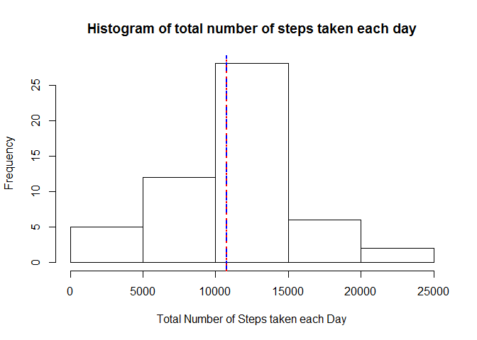
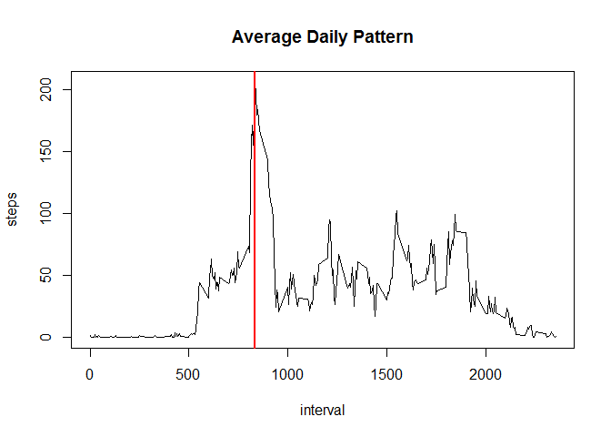
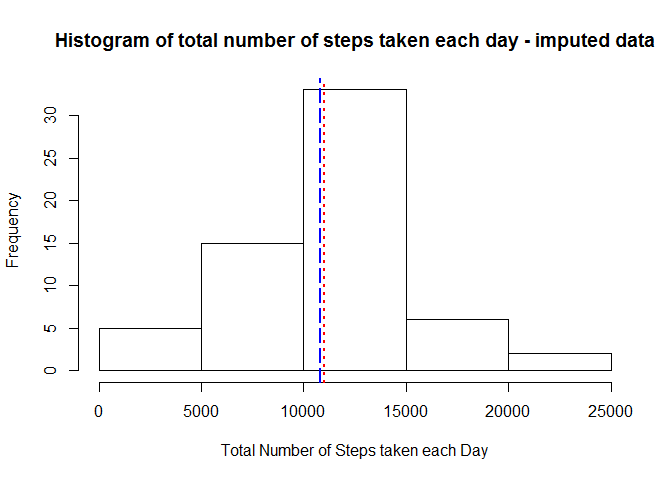
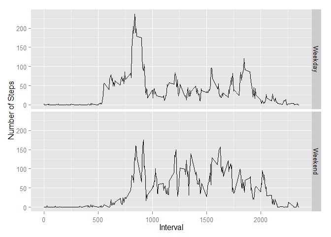

# Reproducible Research: Peer Assessment 1

```r
library(ggplot2)
library(plyr)
```

## Loading and preprocessing the data


```r
activity <- read.csv("activity.csv", as.is=TRUE)

activity$date <- as.POSIXct(strptime(activity$date, format="%Y-%m-%d"))

activity_daily <- ddply(activity[!is.na(activity$steps),], 
                        .(date), summarize, steps = sum(steps))
```

## What is mean total number of steps taken per day?


```r
hist(activity_daily$steps, xlab="Total Number of Steps taken each Day",
     main="Histogram of total number of steps taken each day")

mean_steps_per_day <- mean(activity_daily$steps)
mean_steps_per_day
```

```
## [1] 10766
```

```r
median_steps_per_day <- median(activity_daily$steps)
median_steps_per_day
```

```
## [1] 10765
```

```r
#lets draw mean and median lines
abline(v = c(mean_steps_per_day, median_steps_per_day), 
       col = c("blue", "red"), lwd = 2, lty=c(5,3))
```

 

## What is the average daily activity pattern?


```r
activity_daily_pattern <- ddply(activity[!is.na(activity$steps),], 
                                .(interval), summarize, steps = mean(steps))

with(activity_daily_pattern, plot(interval, steps, type="l",
                    main="Average Daily Pattern"))

m <- activity_daily_pattern[activity_daily_pattern$steps == 
                                max(activity_daily_pattern$steps),]$interval
abline(v=m, col="red", lwd=2)
```

 

## Imputing missing values


```r
# rows with NAs
summary(activity)
```

```
##      steps            date                        interval   
##  Min.   :  0.0   Min.   :2012-10-01 00:00:00   Min.   :   0  
##  1st Qu.:  0.0   1st Qu.:2012-10-16 00:00:00   1st Qu.: 589  
##  Median :  0.0   Median :2012-10-31 00:00:00   Median :1178  
##  Mean   : 37.4   Mean   :2012-10-31 00:25:34   Mean   :1178  
##  3rd Qu.: 12.0   3rd Qu.:2012-11-15 00:00:00   3rd Qu.:1766  
##  Max.   :806.0   Max.   :2012-11-30 00:00:00   Max.   :2355  
##  NA's   :2304
```

```r
# alternatively
sum(is.na(activity$steps))
```

```
## [1] 2304
```

```r
# Compute mean of steps by day of week and interval (for steps != NA)
# We replace NA values with the corresponding avg value for the same Day of the Week
# and interval
# eg

# in our original data, here is a row with an NA value
#     steps  date	    interval	dow
# 1	  NA	 2012-10-01	0	        Monday
# 
# The mean for Monday, interval 1, is 1.4285714
# dow       interval	steps
# Monday    0	        1.4285714
# 
# In out output, we will replace NA with 1.4285714
#     steps	    date	    interval	dow
# 1	  1.4285714	2012-10-01	0	        Monday
```

```r
activity$dow <-  weekdays(activity$date)
activity_daily_mean_int <- ddply(activity, .(dow, interval), 
                             summarize, steps = mean(steps, na.rm=TRUE))

impute.mean <- function(x, y, z) 
    replace(x, is.na(x), 
            activity_daily_mean_int[activity_daily_mean_int$dow == y & 
                                        activity_daily_mean_int$interval == z,]$steps)

dat2 <- ddply(activity, ~ date, transform, steps = impute.mean(steps, dow, interval))

dat2_daily <- ddply(dat2[!is.na(dat2$steps),], 
                        .(date), summarize, steps = sum(steps))

hist(dat2_daily$steps, xlab="Total Number of Steps taken each Day",
     main="Histogram of total number of steps taken each day - imputed data")

mean_steps_per_day_impute <- mean(dat2_daily$steps)
mean_steps_per_day_impute
```

```
## [1] 10821
```

```r
median_steps_per_day_impute <- median(dat2_daily$steps)
median_steps_per_day_impute
```

```
## [1] 11015
```

```r
#lets draw mean and median lines
abline(v = c(mean_steps_per_day_impute, median_steps_per_day_impute), 
       col = c("blue", "red"), lwd = 2, lty=c(5,3))
```

 


## Are there differences in activity patterns between weekdays and weekends?


```r
is.weekend <- function(x) 
    ifelse(x == "Saturday" | x == "Sunday", "Weekend","Weekday")

dat3 <- ddply(dat2, ~ date, transform, day = is.weekend(dow))

dat3_daily_pattern <- ddply(dat3, .(interval,day), summarize, steps = mean(steps))

par(mfrow=c(2,1))
with(dat3_daily_pattern, plot(interval, steps, type="l",
                    main="Average Daily Pattern"))

m <- activity_daily_pattern[activity_daily_pattern$steps == 
                                max(activity_daily_pattern$steps),]$interval
abline(v=m, col="red", lwd=2)

g <- ggplot(dat3_daily_pattern, aes(interval, steps))
g + geom_line() +  facet_grid(day~.) +
    labs(y="Number of Steps", x="Interval")
```

 
